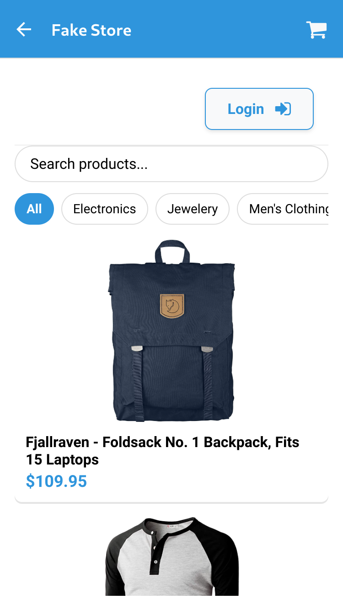
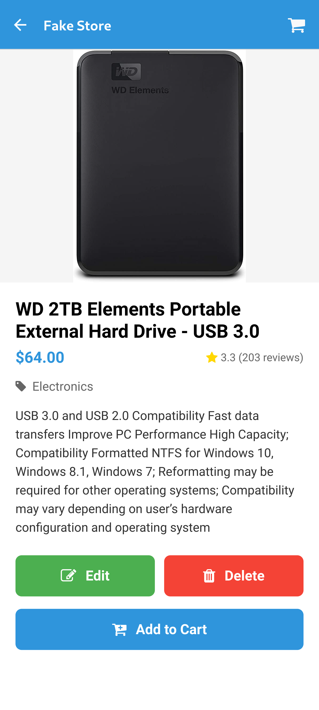
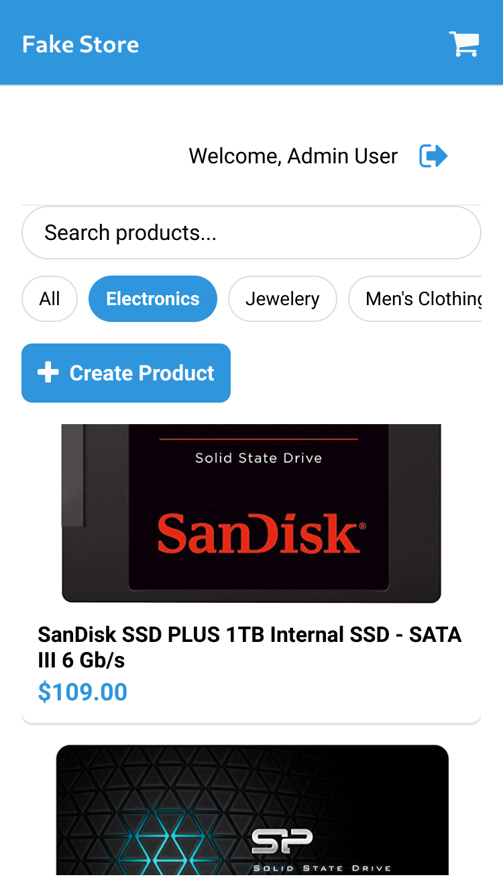
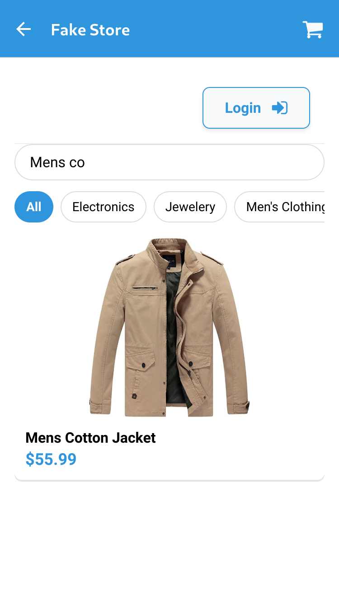
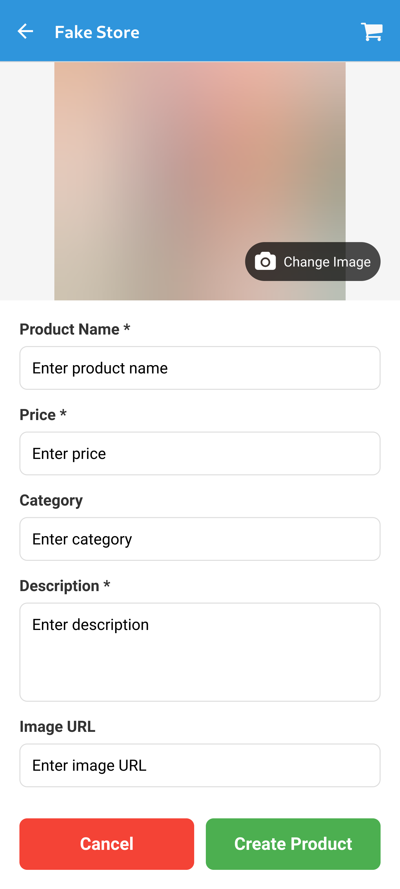
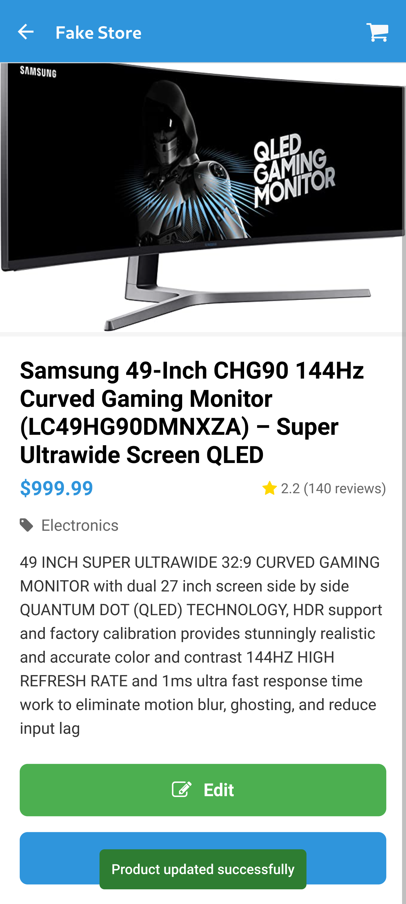
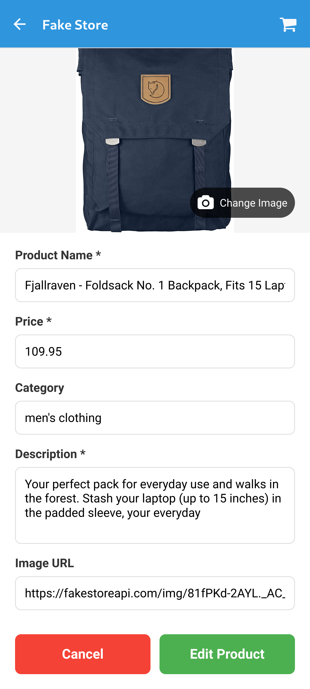
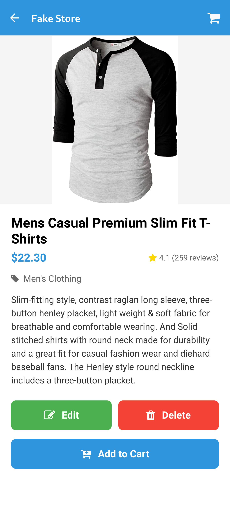

# Welcome to your Expo App 👋

This is an [Expo](https://expo.dev) project created with [`create-expo-app`](https://www.npmjs.com/package/create-expo-app).

## Get Started

1. Install dependencies:

   ```bash
   npm install
   ```

2. Start the app:

   ```bash
   npx expo start
   ```

In the output, you'll find options to open the app in:
- [Development build](https://docs.expo.dev/develop/development-builds/introduction/)
- [Android emulator](https://docs.expo.dev/workflow/android-studio-emulator/)
- [iOS simulator](https://docs.expo.dev/workflow/ios-simulator/)
- [Expo Go](https://expo.dev/go), a limited sandbox for trying out app development with Expo

You can start developing by editing the files inside the **app** directory. This project uses [file-based routing](https://docs.expo.dev/router/introduction).

## Learn More

To learn more about developing your project with Expo, check these resources:
- [Expo documentation](https://docs.expo.dev/): Learn fundamentals or advanced topics with our [guides](https://docs.expo.dev/guides).
- [Learn Expo tutorial](https://docs.expo.dev/tutorial/introduction/): Follow a step-by-step tutorial to create a project that runs on Android, iOS, and the web.

## Join the Community

Join our community of developers creating universal apps:
- [Expo on GitHub](https://github.com/expo/expo): View our open source platform and contribute.
- [Discord community](https://chat.expo.dev): Chat with Expo users and ask questions.

## About the Logo
- The logo in the login page was generated by ChatGPT.

# Features

## List Views

### Guest View
<div align="center">
  
</div>

### Product Details Page
<div align="center">
  
</div>

### Filter by Category
<div align="center">
  
</div>

### Filter by Search
<div align="center">
  
</div>

## Create

### Create Form
Only admin can create products.
<div align="center">
  
</div>

## Edit
The guest user cannot edit products.
<div align="center">
  
</div>

### Edit Form
<div align="center">
  
</div>

## Delete
Click the delete button (if you don't see the delete button, it means you're not logged in as an admin - logout and relogin).
<div align="center">
  
</div>

# Notes

- The edit component is used for the creation as well.

# Credits
- DeepSeek provided code ideas for most pages of this mobile app and helped with refactoring.
- DeepSeek helped fix and improve some page styles to make them look better.
- The mobile idea is based on the corresponding web project: [https://github.com/nouaim/ecommerce-sample](https://github.com/nouaim/ecommerce-sample)
